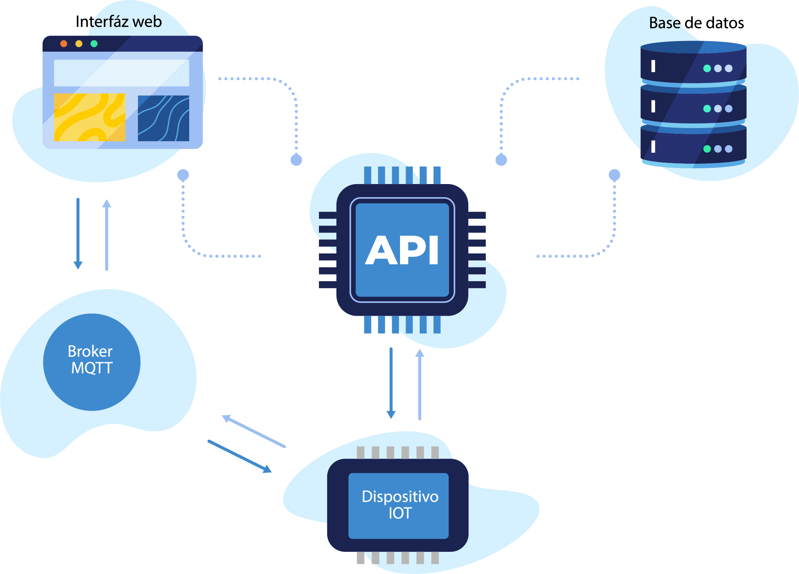

# Plataforma IoT – Proyecto de Tesis

Sistema IoT desarrollado como proyecto de tesis de **Ingeniería en Telecomunicaciones**.
El objetivo del trabajo fue diseñar e implementar un **prototipo funcional de punta a punta**,
integrando hardware, software embebido, backend y frontend web.

## 📌 Contexto del proyecto

Este proyecto forma parte del trabajo final de la carrera de Ingeniería en Telecomunicaciones.
El enfoque fue principalmente **práctico**, priorizando la integración real de todos los
componentes de una plataforma IoT: desde el dispositivo físico hasta la visualización de datos
en una aplicación web.

El sistema permite gestionar dispositivos IoT, comunicarse mediante MQTT, almacenar datos
y administrarlos desde una plataforma web.

## 🧩 Arquitectura general

  

La solución está compuesta por los siguientes módulos:

- **Dispositivo IoT** basado en ESP32
- **Backend (API REST)** para autenticación, gestión de usuarios y dispositivos
- **Frontend web** para administración y visualización de información
- **Documentación pública de la API**

Cada componente fue desarrollado y probado de forma independiente, y luego integrado
en un sistema completo.

## 📦 Componentes del proyecto

### 🔌 Firmware – Dispositivo IoT (ESP32)

Firmware del dispositivo IoT prototipo, encargado de la comunicación y el envío de datos
hacia la plataforma.

👉 Repositorio:  
https://github.com/adriangallicet/ESP32firmware

### 🌐 Backend – API REST

API encargada de la autenticación, gestión de dispositivos, usuarios y datos.
La autenticación se realiza mediante **cookies HTTP-only**.

👉 Código:  
https://github.com/adriangallicet/plataforma-IoT  

👉 Documentación de la API:  
https://adriangallicet.github.io/api_doc/

### 🖥 Frontend – Plataforma Web

Aplicación web para la administración de dispositivos IoT y visualización de información
en tiempo real.

👉 Repositorio:  
https://github.com/adriangallicet/plataforma-IoT

## 🚧 Estado del proyecto

- ✔ Prototipo de dispositivo IoT funcional
- ✔ API REST implementada y documentada
- ✔ Plataforma web operativa
- ✔ Comunicación mediante MQTT
- ✔ Autenticación basada en cookies
- ✔ Proyecto **cerrado académicamente**

El proyecto queda **abierto a mejoras y extensiones futuras**.

## 🎓 Alcance académico

Este trabajo fue desarrollado con fines académicos como parte de la tesis de
Ingeniería en Telecomunicaciones.  
El foco estuvo puesto en la arquitectura del sistema, la integración de tecnologías
y la implementación de una solución IoT realista y funcional.

## 🎥 Demo

Actualmente no hay una demo online.
Está previsto agregar una **demo visual (GIF o video corto)** mostrando el funcionamiento
general de la plataforma y la interacción con el dispositivo IoT.

## 👤 Autor

**Adrián Gallicet**  
Proyecto de tesis – Ingeniería en Telecomunicaciones

